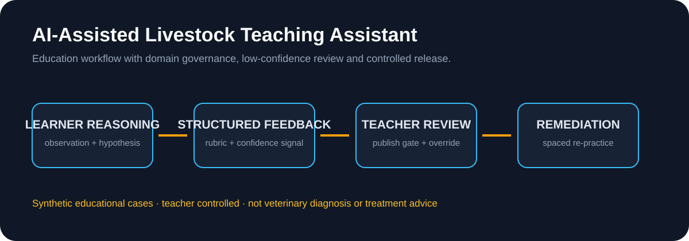

# AI-Assisted Livestock Teaching Assistant

A public-safe portfolio case for an AI-assisted livestock and veterinary teaching workflow. It shows how domain learning content, structured assessment, teacher review, remediation, and deployment constraints can be designed as one product system.

**Status:** Public-safe product case and synthetic demonstration package. The private source project is not mirrored here. This repository contains no textbook images, recovered exam questions, real student records, platform credentials, internal URLs, or production deployment claims.

**Role lens:** AI Product Management · AI Solutions · Learning Workflows · Domain Data Governance

## Case evidence: role / inputs / outputs / result / boundary

| | Portfolio proof |
|---|---|
| **My role** | Owned the learning workflow, reasoning rubric, low-confidence review queue, content governance, remediation loop and teacher release gate. |
| **Inputs** | Synthetic case observation, learner hypothesis, learning objective and teacher-configured rubric. |
| **AI + system work** | AI organizes evidence, drafts feedback and suggests practice; deterministic scoring and teacher review remain the control points. |
| **Outputs** | Evidence checklist, structured feedback, confidence/review state, remediation exercise and teacher progress view. |
| **Result** | A public-safe product case and synthetic demo package that shows how a domain agent can be useful without claiming clinical validity or school outcomes. |
| **Boundary** | Educational assistance only; no autonomous diagnosis, treatment recommendation, real student record or private source implementation is exposed. |

## Product problem

Livestock and veterinary learners need to connect observation, reasoning, evidence, and prevention planning. Teachers need a repeatable way to review answers, identify low-confidence or weak reasoning, and assign targeted remediation without treating an AI output as professional or academic authority.

## Learning workflow

    Case observation
        ↓
    Learner hypothesis + reasoning
        ↓
    Structured rubric feedback
        ↓
    Teacher review and release gate
        ↓
    Remediation / spaced practice
        ↓
    Teacher progress report

## What this public package demonstrates

- domain-specific learning workflow design;
- structured reasoning and rubric criteria;
- low-confidence and disagreement review paths;
- teacher-controlled feedback and publishing;
- synthetic case authoring and content governance;
- platform-constrained rollout and human fallback thinking;
- a clear boundary between educational assistance and veterinary advice.

The AI may help organize feedback, generate a draft explanation, or suggest a follow-up exercise. It cannot independently diagnose an animal, prescribe treatment, publish course content, or replace a teacher, veterinarian, or institutional review process.

## Repository map

- [docs/product-brief.md](docs/product-brief.md) — users, problem, scope, and role boundary
- [docs/workflow-and-review-gates.md](docs/workflow-and-review-gates.md) — learner, teacher, and release states
- [docs/synthetic-case-set.md](docs/synthetic-case-set.md) — self-authored fictional case cards
- [docs/public-data-boundary.md](docs/public-data-boundary.md) — privacy, copyright, and safety boundary
- [docs/portfolio-evidence-index.md](docs/portfolio-evidence-index.md) — recruiter reading path and evidence status
- [docs/demo-script.md](docs/demo-script.md) — safe walkthrough using synthetic content
- [THIRD-PARTY-NOTICES.md](THIRD-PARTY-NOTICES.md) — content rights and publication boundary

> This repository is a portfolio reconstruction. It must not be presented as the private platform, an official school deployment, a clinical decision system, or a copy of any employer or institution's content.

## Public-safe product decisions

The reviewed private baseline was distilled into a separate public-safe product artifact. It contains product decisions and review boundaries only; it does not mirror private implementation, real records, credentials, internal URLs, or source content.

- [Public-safe product decisions](docs/public-safe-product-decisions.md)
